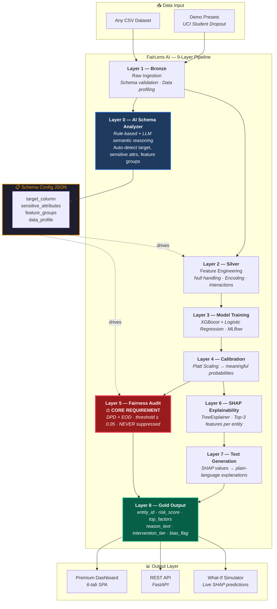

# FairLens AI

### Universal Fairness & Explainability Pipeline
**Domain-Agnostic · Audit-Ready · Human-Interpretable**

---

## 🎯 What is FairLens AI?

FairLens AI is a 9-layer ML pipeline that predicts student dropout risk while ensuring every prediction is **fair**, **explainable**, and **audit-ready**. It automatically detects bias across protected demographic groups and generates human-readable explanations for every decision.

> *"FairLens AI is not a domain-specific tool — it is a universal fairness and explainability layer that can be integrated into any AI decision-making pipeline."*

---

## 🏗️ Architecture



### Layer-by-Layer Data Flow

```
CSV ──→ [Bronze] ──→ [Schema Analyzer] ──→ JSON Config
                          │
          ┌───────────────┘
          ▼
      [Silver] ──→ [Model Training] ──→ [Calibration]
                                              │
                              ┌───────────────┼───────────────┐
                              ▼               ▼               │
                       [Fairness Audit]  [SHAP Explain]       │
                              │               │               │
                              │          [Text Gen]           │
                              │               │               │
                              └───────┬───────┘               │
                                      ▼                       │
                                [Gold Output] ◄───────────────┘
                                      │
                              ┌───────┼───────┐
                              ▼       ▼       ▼
                           [Dashboard] [API] [What-If]
```

---

## ⚡ Quick Start

### Prerequisites
- Python 3.10+
- pip

### Install & Run

```bash
# 1. Install dependencies
cd backend
pip install -r requirements.txt

# 2. Start the server
python main.py
```

Open **http://localhost:8000** in your browser.

### Run the Pipeline

1. Click **Pipeline** in the sidebar
2. Click **Run Pipeline** button
3. Watch all 9 layers execute in real-time (~60 seconds)
4. Explore results across all dashboard tabs

---

## 📊 Key Features

### AI Schema Analyzer (Layer 0)
- **Zero-config**: Automatically identifies target columns, sensitive attributes, and feature groups
- **Phase 1**: Rule-based keyword matching (fast, reliable)
- **Phase 2**: LLM semantic reasoning for ambiguous columns

### Fairness Audit (Layer 5) — Core Requirement
- **Demographic Parity Difference (DPD)**: Equal positive prediction rates across groups
- **Equal Opportunity Difference (EOD)**: Equal true positive rates across groups
- **Threshold**: ≥ 0.05 triggers bias flag
- **Never suppresses findings** — all disparities are logged and reported

### SHAP Explainability (Layer 6)
- **TreeExplainer**: SHAP values for every prediction
- **Top-3 factors**: Most impactful features per entity
- **Global importance**: Feature ranking across all predictions

### Gold Output Table (Layer 8)
| Field | Description |
|---|---|
| `entity_id` | Unique student identifier |
| `risk_score` | Calibrated dropout probability [0,1] |
| `top_factors` | SHAP-ranked top 3 contributing features |
| `reason_text` | Plain-language explanation |
| `intervention_tier` | High / Medium / Low |
| `bias_flag` | True if fairness threshold breached |

---

## 🖥️ Dashboard

| Tab | Description |
|---|---|
| **Dashboard** | KPI metrics, tier distribution, model comparison, Gold table |
| **Pipeline** | 9-layer pipeline visualization with real-time progress |
| **Schema Analyzer** | AI-detected column classifications and feature groups |
| **Fairness Audit** | DPD/EOD bar charts, threshold lines, detailed audit table |
| **Explainability** | Global SHAP importance, entity search, per-entity factors |
| **What-If Simulator** | Adjust features, get live predictions with SHAP explanation |

---

## 🛠️ Tech Stack

| Component | Technology |
|---|---|
| ML Models | XGBoost + Logistic Regression |
| Calibration | Platt Scaling (CalibratedClassifierCV) |
| Explainability | SHAP (TreeExplainer) |
| Fairness | Custom DPD/EOD implementation |
| Tracking | MLflow |
| Backend | FastAPI + Uvicorn |
| Frontend | Vanilla JS SPA + CSS |
| Dataset | UCI Student Dropout (4,424 students, 36 features) |

---

## 📁 Project Structure

```
FairLens/
├── backend/
│   ├── main.py                          # FastAPI server
│   ├── requirements.txt                 # Python dependencies
│   ├── pipeline/
│   │   ├── layer0_schema_analyzer.py    # AI Schema Analyzer
│   │   ├── layer1_bronze.py             # Raw Ingestion
│   │   ├── layer2_silver.py             # Feature Engineering
│   │   ├── layer3_model.py              # Model Training
│   │   ├── layer4_calibration.py        # Platt Scaling
│   │   ├── layer5_fairness.py           # Fairness Audit (DPD/EOD)
│   │   ├── layer6_shap.py              # SHAP Explainability
│   │   ├── layer7_text_gen.py           # Text Generation
│   │   ├── layer8_gold.py              # Gold Output Table
│   │   └── orchestrator.py              # Pipeline Runner
│   ├── data/                            # Bronze/Silver/Gold outputs
│   └── models/                          # Trained model artifacts
├── frontend/
│   ├── index.html                       # SPA shell
│   ├── index.css                        # Premium dark theme
│   ├── app.js                           # Router + API client
│   └── components/                      # Dashboard view modules
└── FairLens_AI_PRD_v2.md               # Product Requirements
```

---

## 📈 Model Performance

| Model | AUC | Accuracy | F1 |
|---|---|---|---|
| **XGBoost** ✓ | 0.932 | 0.881 | 0.815 |
| Logistic Regression | 0.917 | 0.869 | 0.803 |

Calibration improves Brier score by ~4.5% via Platt Scaling.

---

## ⚖️ Fairness Results

Sensitive attributes automatically detected and audited:
- **Gender** — DPD: 0.2061 🚨
- **Age at enrollment** — DPD: 0.3576 🚨, EOD: 0.0667 🚨
- **Tuition fees** — DPD: 0.6273 🚨, EOD: 0.0566 🚨
- **Debtor status** — DPD: 0.3535 🚨
- **Scholarship holder** — DPD: 0.2667 🚨
- **International** — DPD: 0.027 ✅, EOD: 0.016 ✅

**All findings reported. No bias is suppressed.**

---

## 📜 License

Hackathon project — Anthropic Hackathon 2026.

Dataset: [UCI ML Repository](https://archive.ics.uci.edu/dataset/697) — CC BY 4.0.
